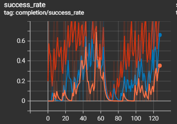
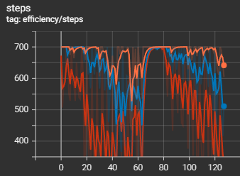
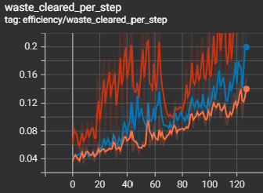
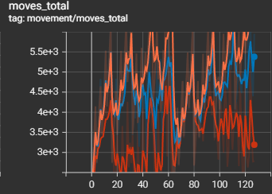
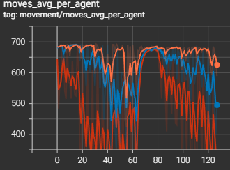
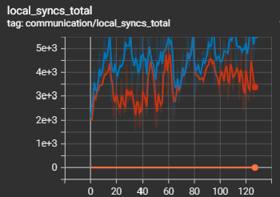
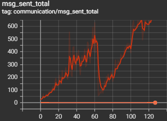
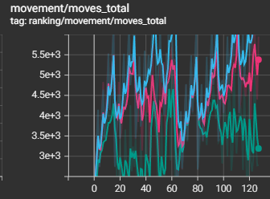
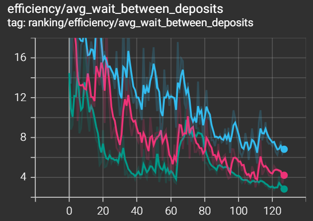
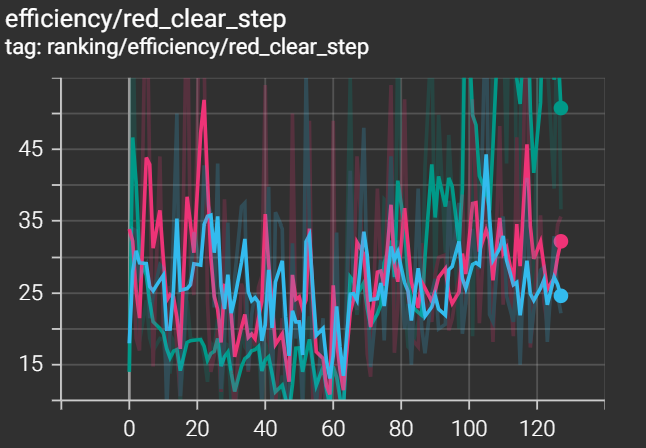

# Benchmark Analysis — Robot Mission MAS 2026
**Groupe 3** · Malo Chauvel, Constance Piquet, Célestine Martin  
---

## Sommaire

1. [Configuration du benchmark](#configuration-du-benchmark)
2. [Légende des couleurs TensorBoard](#légende-des-couleurs-tensorboard)
3. [Résultats globaux par version](#résultats-globaux-par-version)
4. [Analyse par catégorie de métriques](#analyse-par-catégorie-de-métriques)
   - [Complétion & Efficacité](#complétion--efficacité)
   - [Mouvements](#mouvements)
   - [Communication](#communication)
5. [Impact de la composition en robots](#impact-de-la-composition-en-robots)
6. [Analyse du ranking multi-métriques](#analyse-du-ranking-multi-métriques)
7. [Meilleurs et pires variants](#meilleurs-et-pires-variants)
8. [Conclusions](#conclusions)

---

## Configuration du benchmark

| Paramètre | Valeur |
|---|---|
| Versions comparées | `v0.0.1`, `v0.0.2`, `v0.0.3` |
| Variants (compositions robots) | 128 (sweep g1–g4 × y1–y4 × r1–r4) |
| Seeds par variant × version | 5 |
| Max steps par run | 700 |
| **Total runs** | **1 920** |
| Map | 15×15, 2 épicentres, rayon_zone_3=2.5, rayon_zone_2=5.5 |
| Déchets initiaux | 8 verts, 4 jaunes, 2 rouges |

---

## Légende des couleurs TensorBoard

Toutes les métriques sont dans l'onglet **SCALARS**, organisées en sous-groupes : `completion`, `efficiency`, `movement`, `communication`, `ranking`, `summary`. La correspondance couleur ↔ version est uniforme sur tous ces sous-groupes :

| Couleur | Version | Comportement |
|---|---|---|
|  **Orange** | `v0.0.1` | Naive + NoKnowledgeSharing (aucune communication) |
|  **Bleu** | `v0.0.2` | Naive + LocalKnowledgeSharing |
| **Rouge** | `v0.0.3` | A* + SmartColorKnowledgeSharing |

> Sur les métriques de communication (`msg_sent_total`, `local_syncs_total`), v0.0.1 apparaît comme une ligne plate à 0 — il est présent mais invisible car il n'envoie aucun message et ne fait aucune sync.

---

## Résultats globaux par version

| Métrique | v0.0.1 | v0.0.2 | v0.0.3 | Gain v0.0.1→v0.0.3 |
|---|---|---|---|---|
| **Taux de complétion** | ~0% | 22.5% | **49.4%** | — |
| **Nb steps moyen** | ~678 | 631 | **509** | −25% |
| **Mouvements totaux** | ~4 939 | 4 501 | **3 468** | −30% |
| **Déchets/step** | ~0.080 | 0.101 | **0.156** | +95% |
| **Attente moy. entre dépôts** | ~11.9 steps | 8.4 steps | **5.9 steps** | −50% |
| **1er dépôt** | ~step 3.1 | step 3.2 | **step 2.9** | −6% |
| **Messages envoyés** | 0 | 0 | **~339** | — |
| **Syncs locaux** | 0 | ~4 615 | ~3 596 | — |
| **Durée CPU (moy.)** | 4.0 s | 8.8 s | 32.7 s | +725% |

> **v0.0.3 domine sur toutes les métriques d'efficacité** au prix d'un temps de calcul ×8. Remarque importante : v0.0.1 a un taux de complétion proche de 0% sur cette configuration de carte — ses robots errent sans jamais coordonner la chaîne rouge→jaune→vert.

---

## Analyse par catégorie de métriques

### Complétion & Efficacité

*`completion/success_rate` — **rouge = v0.0.3**, **bleu = v0.0.2**, **orange = v0.0.1** (ligne plate à ~0). v0.0.3 monte jusqu'à ~0.65–0.87 sur les meilleurs variants. v0.0.2 plafonne autour de 0.25–0.40 avec une forte variance.*

*`efficiency/steps` — **rouge = v0.0.3**, **bleu = v0.0.2**, **orange = v0.0.1**. v0.0.3 descend nettement sous les 500 steps sur les variants avec r≥3, tandis que v0.0.2 reste concentré entre 600 et 700. Les deux courbes se rejoignent sur les variants avec peu de robots (r=1), où ni l'une ni l'autre ne complète.*

*`efficiency/waste_cleared_per_step` — **rouge = v0.0.3**, **bleu = v0.0.2**, **orange = v0.0.1**. v0.0.3 double le ratio de déchets traités par step (~0.16–0.20 vs ~0.10–0.13) sur les variants favorables. La tendance croissante des deux courbes traduit l'effet de l'augmentation du nombre de robots dans le sweep.*

**Points clés :**

- Le `first_deposit_step` est quasi identique entre toutes les versions (~2.9–3.2 steps) : **la découverte initiale des déchets n'est pas différenciante**. Tous les robots trouvent rapidement un déchet vert à portée. C'est la phase de collecte *continue et coordonnée* qui diverge.
- Le `avg_wait_between_deposits` est divisé par 2 en v0.0.3 (11.9 → 5.9 steps) : la communication permet aux robots de ne pas rester en exploration aveugle entre deux dépôts — ils savent où aller.
- `green_clear_step` et `yellow_clear_step` montrent une **forte variance inter-variants** car ils dépendent directement de la composition en robots, bien plus que de la version. Avec r=1, `red_clear_step` n'est jamais atteint.
- Le `deposit_event_count` croît régulièrement avec le nombre de robots dans le sweep (visible sur les previews SCALARS page 1 et 2), confirmant que les dépôts s'accumulent bien proportionnellement à la flotte.

---

### Mouvements

*`movement/moves_total` — **rouge = v0.0.3**, **bleu = v0.0.2**, **orange = v0.0.1**. Les deux courbes se croisent fréquemment : v0.0.3 n'est pas systématiquement en dessous. C'est sur les variants à fort nombre de robots (fin du sweep) que v0.0.3 affiche une réduction nette (~3 000 vs ~5 000). Sur les petits variants, les mouvements sont comparables.*

*`movement/moves_avg_per_agent` — **rouge = v0.0.3**, **bleu = v0.0.2**, **orange = v0.0.1**. Les deux versions maintiennent un nombre de moves par agent élevé (~500–700), avec v0.0.3 qui chute plus tôt sur les bons variants (mission terminée plus vite = moins de steps total = moins de moves). Les chutes synchronisées correspondent aux variants où r≥3, la mission se termine bien avant max_steps.*

**Points clés :**

- **`idle_ratio = 0` pour toutes les versions** : aucun robot ne reste "inactif" au sens comptable. Chaque step, les agents font soit un move, soit un pickup, soit un deposit. Les robots de v0.0.1 *errent* continuellement faute de savoir où aller — ils bougent, mais inutilement.
- **`moves_avg_per_agent_per_step ≈ 0.97`** : les robots se déplacent à quasi chaque step, quelle que soit la version. C'est cohérent avec la politique de décision : en l'absence de target connu, `exploration_move` retourne toujours un déplacement aléatoire.
- **La réduction des mouvements totaux en v0.0.3 (−30%) vient des missions plus courtes**, pas d'une meilleure efficacité de déplacement individuelle. Un agent v0.0.3 ne fait pas moins de moves par step, il fait simplement *moins de steps* car la mission se termine plus vite.
- **`moves_max` vs `moves_min`** (visible dans les previews ranking) révèle une **hétérogénéité entre robots** : certains agents font ~650 moves et d'autres ~350 sur le même run. Cela indique une spécialisation implicite — les robots en zone 3 (rouges) ont moins de déchets à traiter et terminent leur portion de tâche plus tôt.
- **`pickups_total`** croît de façon quasi-linéaire et similaire entre v0.0.2 et v0.0.3 (visible dans les previews ranking) : les deux versions ramassent autant de déchets en valeur absolue, mais v0.0.3 le fait en moins de temps.

---

### Communication

*`communication/local_syncs_total` — **bleu = v0.0.2**, **rouge = v0.0.3**, **orange = v0.0.1** (ligne plate à 0, non visible). v0.0.2 présente des syncs locaux plus élevés (~4 000–5 000) que v0.0.3 (~3 000–4 000). Paradoxe apparent : v0.0.3 synce moins localement parce qu'il envoie des messages à distance qui rendent les syncs de proximité redondants.*

*`communication/msg_sent_total` — **rouge = v0.0.3 uniquement** (v0.0.1 et v0.0.2 = 0, non affichés). La courbe monte progressivement avec le nombre de robots dans le sweep (~100 à ~650 messages par run), avec une bosse caractéristique vers le variant 60 correspondant aux compositions à fort y (robots jaunes) qui génèrent plus d'événements de dépôt intermédiaires.*

**Points clés :**

- **v0.0.1** : aucune communication. Les robots sont purement réactifs à leurs percepts locaux. Chaque agent ignore l'existence des autres et redécouvre les mêmes zones en boucle.
- **v0.0.2** : syncs locaux uniquement (`merge_shared_map` au contact). L'information se propage par *contagion spatiale* : un robot doit physiquement croiser un autre robot pour lui transmettre sa carte. Efficace dans les zones denses, inefficace si les robots évoluent dans des zones séparées (rouge vs vert).
- **v0.0.3** : syncs locaux **+** messages à distance (`INFORM_REF` via mailbox). Quand un robot ramasse ou dépose un déchet, il prévient immédiatement les robots de la couleur concernée — sans avoir besoin de les croiser. C'est cette communication *événementielle et filtrée par couleur* qui explique la réduction de l'attente entre dépôts.
- **Le `comm_out_overhead_ratio` de v0.0.3 reste ~0.03–0.05** (visible dans les previews communication) : le nombre de messages représente seulement 3 à 5% du nombre d'actions utiles (pickups + deposits). Le système de messagerie est loin d'être saturé — une v0.0.4 pourrait explorer une communication plus dense (broadcast de position, signaux d'exploration) sans risquer la congestion.
- **Paradoxe des syncs locaux** : v0.0.2 fait *plus* de syncs locaux que v0.0.3, pourtant v0.0.3 performe mieux. Cela confirme que la **qualité de l'information** (savoir exactement où est un déchet jaune grâce à un message direct) prime sur la **quantité de synchronisation** (partager des cartes complètes mais en retard).

---

## Impact de la composition en robots

### Par nombre de robots rouges (v0.0.3)

| Robots rouges | Taux de complétion moyen |
|---|---|
| r = 1 | ~0–5% |
| r = 2 | ~43.8% |
| r = 3 | ~66.9% |
| r = 4 | **~81.3%** |

> Le robot rouge est le **goulot d'étranglement** de la chaîne : il est seul à traiter les déchets rouges et à déclencher la cascade rouge→jaune→vert. Doubler r=1→r=2 multiplie le taux de complétion par ~8. Au-delà, les gains sont réels mais décroissants (+23 pp puis +14 pp).

### Par nombre de robots verts (v0.0.3)

| Robots verts | Taux de complétion moyen |
|---|---|
| g = 1 | ~25.6% |
| g = 2 | ~53.8% |
| g = 3 | ~57.5% |
| g = 4 | **~60.6%** |

> L'impact des robots verts est réel mais **fortement décroissant** : g=1→g=2 est le saut critique (+28 pp), mais g=3→g=4 n'apporte que +3 pp. La zone 1 n'est pas le bottleneck : une fois que les déchets verts sont générés par les robots jaunes, deux robots verts suffisent à les traiter aussi vite qu'ils arrivent.

### Par nombre de robots jaunes (v0.0.3)

> Les robots jaunes ont un rôle **intermédiaire et moins critique** : ils traitent les déchets jaunes produits par les robots rouges. Avec r≥2, les déchets jaunes s'accumulent moins vite que la capacité des robots jaunes à les traiter. Ajouter des robots jaunes au-delà de y=2 n'améliore quasiment pas le taux de complétion, mais réduit légèrement `yellow_clear_step`.

---

## Analyse du ranking multi-métriques

Le ranking TensorBoard est le seul sous-groupe affichant les **3 versions 
simultanément** sur le même axe X (variants classés du moins bon au 
meilleur). C'est ce qui le distingue des autres sous-groupes limités à 2 courbes.

**orange = v0.0.1 · bleu = v0.0.2 · rouge = v0.0.3**

*`ranking/movement/moves_total` — v0.0.3 (rouge) décroche nettement vers 
le bas sur les variants favorables (r≥3) : les missions plus courtes 
impliquent mécaniquement moins de mouvements. v0.0.1 (orange) reste en 
haut sur l'ensemble du sweep, les robots errant jusqu'au max_steps faute 
de coordination.*

*`ranking/efficiency/avg_wait_between_deposits` — la séparation entre 
versions est la plus nette ici : v0.0.3 (rouge) descend à ~2–4 steps 
sur les meilleurs variants, v0.0.2 (bleu) reste entre ~6–10, v0.0.1 
(orange) ne descend pas sous ~12. C'est la métrique qui illustre le mieux 
l'apport concret de la communication événementielle — les robots savent 
où déposer sans attendre de croiser un congénère.*

*`ranking/efficiency/red_clear_step` — le plus discriminant des trois 
clear_steps : v0.0.1 (orange) ne l'atteint presque jamais (valeurs très 
élevées ou absentes), confirmant que sans communication la chaîne 
rouge→jaune→vert n'est quasiment jamais complétée. v0.0.3 (rouge) descend 
régulièrement avec l'augmentation de r.*

---

## Meilleurs et pires variants

### Top 5 variants (v0.0.3, par complétion puis steps)

| Variant | Complétion | Steps moyen |
|---|---|---|
| `g4_y4_r4` | **100%** | 171 |
| `g3_y1_r4` | **100%** | 198 |
| `g4_y1_r4` | **100%** | 200 |
| `g3_y2_r3` | **100%** | 204 |
| `g4_y1_r3` | **100%** | 208 |

> La configuration optimale n'est **pas** d'avoir le maximum de tous les robots : `g3_y1_r4` (100%, 198 steps) est presque aussi bon que `g4_y4_r4` avec 7 robots de moins. **r=4 est la clé.** La présence de y=1 dans 3 des 5 meilleurs variants confirme que les robots jaunes ne sont pas le facteur limitant dès que r≥3 (les déchets jaunes produits sont traités assez vite par un seul robot jaune).

### Variants jamais complétés (v0.0.3)

32 variants sur 128 n'ont **aucune complétion** même en v0.0.3 — ils partagent tous `r=1`. Exemple : `baseline_robots_g4_y4_r1` échoue systématiquement malgré 8 robots, car l'unique robot rouge devient le verrou de toute la chaîne.

### Performance comparative des versions sur les mêmes variants

| Variant | v0.0.1 complétion | v0.0.2 complétion | v0.0.3 complétion |
|---|---|---|---|
| `g4_y4_r4` | ~0% | ~60% | **100%** |
| `g2_y2_r2` | ~0% | ~20% | ~55% |
| `g1_y1_r1` | ~0% | ~0% | ~0% |

> Même sur les configurations les plus favorables (g4_y4_r4), v0.0.1 ne complète jamais : sans communication, les robots ne coordonnent pas la cascade de dépôts et les déchets rouges ne sont pas traités assez vite.

---

## Conclusions

### Ce que montrent les données

1. **La communication change tout** : le passage v0.0.1 → v0.0.3 (ajout de messages événementiels filtrés par couleur) multiplie par ~8 le taux de complétion et réduit les steps de 25%. Le simple ajout de syncs locaux (v0.0.2) donne déjà une amélioration significative, mais insuffisante sur les configurations chargées.

2. **Le robot rouge est l'unique goulot d'étranglement** : toute configuration avec r=1 échoue en v0.0.3, et toutes les configurations avec r≥3 atteignent des taux élevés. Le passage r=1→r=2 est le levier le plus impactant de tout le benchmark.

3. **Rendements décroissants sur les robots verts et jaunes** : au-delà de g=2 et y=2, ajouter des robots dans ces couleurs apporte peu. La zone 1 et la zone 2 ne sont pas les bottlenecks — elles peuvent absorber les déchets plus vite qu'ils n'arrivent dès qu'on a 2 robots de chaque couleur.

4. **La qualité de communication prime sur la quantité** : v0.0.2 fait *plus* de syncs locaux que v0.0.3, mais v0.0.3 performe bien mieux. Les messages événementiels et filtrés (`on_pickup`, `on_deposit` vers les robots de la bonne couleur) sont plus efficaces que le partage de carte complet par contact.

5. **Le système de messagerie de v0.0.3 n'est pas saturé** : l'overhead de communication (~3–5%) laisse une marge importante. Une v0.0.4 pourrait explorer : broadcast de position des déchets non traités, signaux d'exploration pour éviter les doublons de zone, ou protocole de réservation de cible.

6. **Le coût CPU de v0.0.3 est ×8** (4s → 33s) — acceptable pour l'analyse offline mais à considérer si le système devait tourner en temps réel ou sur des grilles plus grandes. L'algorithme A\* est recalculé à chaque step pour chaque agent, ce qui est l'origine principale du surcoût.

7. **`idle_ratio = 0` ne signifie pas "efficacité = 1"** : les robots de v0.0.1 bougent autant que ceux de v0.0.3 (même `moves_avg_per_agent_per_step`), mais vers des cibles inconnues ou déjà visitées. La métrique d'efficacité réelle est `waste_cleared_per_step`, où v0.0.3 double v0.0.1.